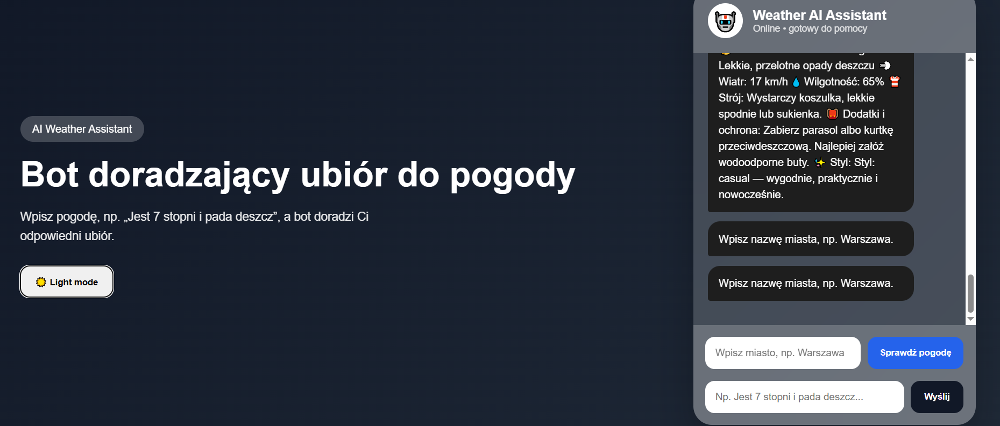

# 🤖 Weather AI Assistant



## 📌 Opis projektu

Weather AI Assistant to inteligentny chatbot webowy stworzony w technologii HTML5, CSS3 oraz JavaScript (Vanilla JS).

Celem aplikacji jest analiza warunków pogodowych oraz rekomendowanie odpowiedniego ubioru użytkownikowi.

Bot może działać na dwa sposoby:

1. Analiza tekstu wpisanego przez użytkownika (np. „Jest 7 stopni i pada deszcz”).
2. Pobieranie aktualnej pogody dla wskazanego miasta przy pomocy WeatherAPI.

Na podstawie otrzymanych danych chatbot generuje rekomendacje dotyczące:

* ubioru,
* dodatków,
* ochrony przed deszczem,
* ochrony przed zimnem,
* stylu ubioru.

---

# 🎯 Cel projektu

Projekt został wykonany w celu demonstracji:

* tworzenia interfejsów webowych,
* wykorzystania JavaScript do budowy chatbota,
* komunikacji z zewnętrznym API,
* projektowania responsywnych stron internetowych,
* przechowywania danych w LocalStorage.

---

# 🛠 Technologie

## Frontend

* HTML5
* CSS3
* JavaScript (Vanilla JS)

## Dodatkowe technologie

* Fetch API
* LocalStorage
* WeatherAPI
* Responsive Web Design

---

# 📂 Struktura projektu

```text
weather-chatbot/
│
├── index.html
├── style.css
├── script.js
├── README.md
│
└── assets/
```

---

# ⚙️ Funkcjonalności

## Chatbot

* wysyłanie wiadomości
* dynamiczne odpowiedzi
* animacja pisania
* automatyczne przewijanie czatu
* historia rozmów

## Analiza pogody

Bot rozpoznaje:

* temperaturę
* deszcz
* śnieg
* wiatr
* upał
* styl ubioru

Przykład:

### Wejście

```text
Jest 7 stopni i pada deszcz
```

### Odpowiedź

```text
Załóż ciepłą kurtkę, zabierz parasol oraz wodoodporne buty.
```

---

# 🌦 Integracja z API pogodowym

Projekt wykorzystuje WeatherAPI.

Przykład działania:

1. Użytkownik wpisuje miasto.
2. Aplikacja wysyła zapytanie do API.
3. Odbierane są dane pogodowe.
4. Generowana jest rekomendacja ubioru.

Przykładowe dane:

```text
Miasto: Warszawa
Temperatura: 12°C
Pogoda: Lekki deszcz
```

---

# 🔒 Walidacja

Aplikacja sprawdza:

## Pole wiadomości

* pusty tekst
* zbyt krótki tekst
* zbyt długi tekst
* same znaki specjalne
* nierealne temperatury

## Pole miasta

* puste pole
* zbyt krótką nazwę
* zbyt długą nazwę
* niedozwolone znaki

---

# 💾 LocalStorage

Historia rozmów jest zapisywana lokalnie.

Dzięki temu:

* po odświeżeniu strony wiadomości pozostają widoczne,
* użytkownik może wrócić do poprzednich rozmów.

---

# 🌙 Dark Mode

Projekt posiada tryb ciemny.

Funkcjonalność realizowana jest poprzez:

```javascript
document.body.classList.toggle("dark");
```

---

# 📱 Responsywność

Aplikacja działa poprawnie na:

* komputerach
* tabletach
* telefonach

Wykorzystano:

```css
@media (max-width: 768px)
```

---

# 🧪 Testy

## Test 1

Wejście:

```text
Jest -5 stopni i pada śnieg
```

Oczekiwany wynik:

```text
Kurtka zimowa, czapka, rękawiczki i ocieplane buty.
```

---

## Test 2

Wejście:

```text
Jest 28 stopni i świeci słońce
```

Oczekiwany wynik:

```text
Lekki ubiór, okulary przeciwsłoneczne oraz woda.
```

---

## Test 3

Wejście:

```text
Warszawa
```

Przycisk:

```text
Sprawdź pogodę
```

Oczekiwany wynik:

```text
Pobranie aktualnej pogody z API.
```

---

# 🚀 Uruchomienie projektu

## Krok 1

Pobierz projekt.

## Krok 2

Otwórz folder projektu.

## Krok 3

W pliku script.js ustaw własny klucz API:

```javascript
const API_KEY = "TWOJ_KLUCZ_API";
```

## Krok 4

Uruchom:

```text
index.html
```

lub użyj:

```text
Live Server (VS Code)
```

---

# 🔮 Możliwe rozszerzenia

* rozpoznawanie miasta wpisanego bezpośrednio w czacie,
* prognoza pogody na kilka dni,
* obsługa geolokalizacji,
* obsługa głosowa,
* Progressive Web App (PWA),
* integracja z Azure OpenAI,
* panel administratora,
* wielojęzyczność.

---

# 👨‍💻 Autor

Szymon Basiul tr20406

Projekt wykonany w ramach zadania:

**Inteligentny Agent AI na stronę WWW – Bot doradzający ubiór do pogody.**
